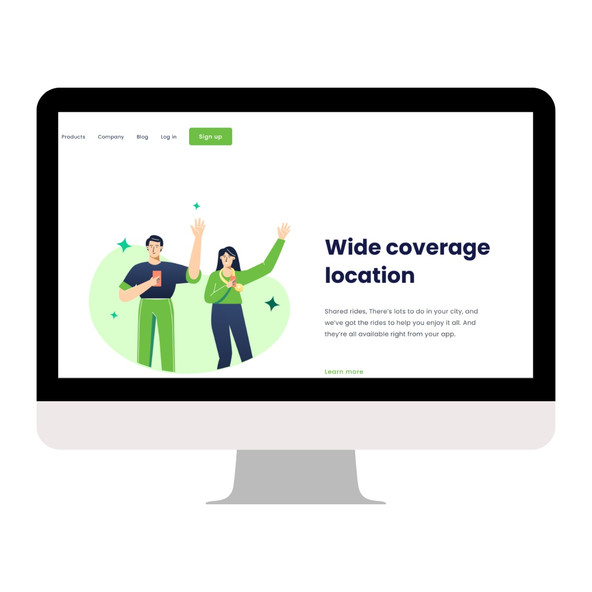

<h1>We Care - Projeto DevClub 👨‍💻</h1>

  Projeto de estudo de HTML e CSS simulando uma página inicial de serviço para pets, com header de navegação, seção principal com título, descrição, logo e botão de ação. Layout responsivo com media query para dispositivos móveis.

<h2>⚒ Tecnologias Utilizadas</h2>

  
  
  

<h2>🌐 Estrutura do Projeto</h2>
<ul>
  <li>📄 <strong>index.html</strong> - Página principal com layout e conteúdo</li>
  <li>🎨 <strong>styles.css</strong> - Estilos aplicados ao header, logo, botões e seções</li>
  <li>🖼 <strong>assets/</strong> - Pasta para imagens (logo e capturas do projeto)</li>
</ul>

<h2>🎨 Destaques do CSS</h2>
<ul>
  <li>📌 Fonte Montserrat aplicada globalmente</li>
  <li>📌 Reset de margens e padding com <code>* { margin:0; padding:0; box-sizing:border-box; }</code></li>
  <li>📌 Header com links e botão de ação "Login", com cores #665ae1 e borda arredondada</li>
  <li>📌 Logo dimensionada com <code>width:568px</code> e <code>height:500px</code>, alinhada à esquerda</li>
  <li>📌 Seção com títulos grandes (<code>h1:100px</code>, <code>h2:58px</code>) e parágrafo explicativo</li>
  <li>📌 Botão "EXPLORE" com cor #ADFF00, borda arredondada e sombra</li>
  <li>📌 Media query para telas menores que 720px: header escondido, logo e seções redimensionadas, parágrafo oculto</li>
</ul>

<h2>📷 Visualização do Projeto</h2>

<h2>🔗 Navegação e Funcionalidades</h2>
<ul>
  <li>🏠 Header com links: Home, About, Product, Service, Contact</li>
  <li>✏️ Botão de ação "Login" no header</li>
  <li>🌟 Seção principal com logo, títulos "We Care" e "About Your Pet", descrição e botão "EXPLORE"</li>
  <li>🎨 Layout responsivo preparado para diferentes resoluções</li>
</ul>

<h2>💡 Observações do Projeto</h2>

  Este projeto é um estudo prático de HTML e CSS, focado em layout responsivo, tipografia moderna e cores harmoniosas. 

</body>
</html>
